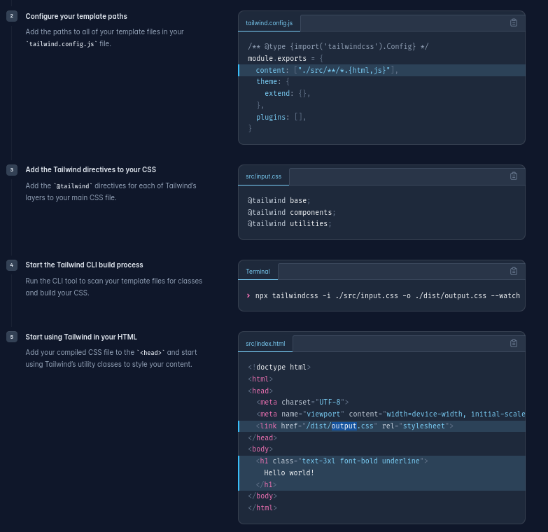

## Pour être présent

Pour que ta présence soit mis je te demande de m'envoyer ton travail en zip dans mon adresse mail [hugo.houbert@epitech.eu](hugo.houbert@epitech.eu)
Ou si tu ne veux pas envoyer de mail tu peux Fork le projet en haut a droite et faire une pull request quand le workshop est terminer.

## Avant de commencer
Tu dois commencer par installer Angular/cli sur ta machine
```
- npm install -g @angular/cli
```
Tu dois installer aussi TailwindCSS pour le style du projet.

```
npm install -D tailwindcss
npx tailwindcss init
```

## Commande a connaître
- ng new { Name_of_the_project }  
Cette commande te permet de crée ton dossier pour ton application web.  
(faite 'y' sur toute les installations)   
(choisissez SCSS a la question du style)

- ng generate {{ component / service }} { name_of_your_file }   
Cette commande te permet de crée de nouveau componant de travail.

- ng serve { --open }   
Cette commande te permet d'ouvrir ton dossier dans ton navigateur web.

Si vous voulez explorer plus de commande dans ce language tout est expliquer sur leur site.
[Angular Doc](https://angular.io/cli)

## Commençons
Tout d'abord faut config tailwind css qui permeteras de crée ton style de page.



Pour toutes les commandes [Tailwind Doc](https://tailwindui.com/components)


Une fois votre projet crée nous allons commencer remplaçé le index.html
par :  
```
<!doctype html>
<html lang="en">
<head>
  <meta charset="utf-8">
  <title>Workshop Angular</title>
  <base href="/">
  <meta name="viewport" content="width=device-width, initial-scale=1">
  <link rel="icon" type="image/x-icon" href="favicon.ico">
  <link rel="stylesheet" href="https://cdnjs.cloudflare.com/ajax/libs/materialize/1.0.0/css/materialize.min.css">
</head>
<body>
  <app-root></app-root>
</body>
</html>
```
Nous allons commencé a crée un nouveau componant dans le quel vous allez faire un formulaire, dans le quel vous aurez de quoi rentrée un nom et un email et un message.

Dans le composant que tu viens de crée tu as un {{le composant que ta crée}}.component.ts dans le quel tu vas mettre ça
```
import { Component } from '@angular/core';

@Component({
  selector: 'app-header',
  templateUrl: './header.component.html',
  styleUrls: ['./header.component.scss']
})
export class HeaderComponent {

  nom: string = '';
  email: string = '';
  message: string = '';

  constructor() { }

  onSubmit() {
    console.log(this.nom);
    console.log(this.email);
    console.log(this.message);
  }
}
```
Puis dans ton HTML tu vas mettre ça
```
<form (ngSubmit)="onSubmit()">
  <div>
    <label for="nom">Nom:</label>
    <input type="text" id="nom" [(ngModel)]="nom" name="nom">
    <label for="email">Email:</label>
    <input type="email" id="email" [(ngModel)]="email" name="email">
    <label for="message">Message:</label>
    <textarea id="message" [(ngModel)]="message" name="message"></textarea>
  </div>
  <button type="submit">Envoyer</button>
</form>
```

Une fois fait je te laisse regarder dans la doc TailwindCSS [ICI](https://tailwindui.com/components) pour que tu puisse mettre du style.
Après avoir le formulaire a ton gout nous allons voir comment envoyer tes informations dans un backend.

Tu vas devoir crée un fichier .json pour pouvoir stocker tes informations.

dans '{{le composant que ta crée}}.component.ts' tu vas devoir crée une fonction qui récupereras les informations de ton HTML et qui te permetteras de l'envoyer vers ton fichier .json

pour envoyer ton form vers ton .json tu vas devoir importer ça :
```import { HttpClient } from '@angular/common/http';```

On est a la fin de ce workshop, maintenant si tu as aimer ou que tu veux en apprendre plus je te redirige vers la vidéo qui ma permis d'apprendre le Angular: [ICI]( https://www.youtube.com/watch?v=DTIYVffhJuU). 
